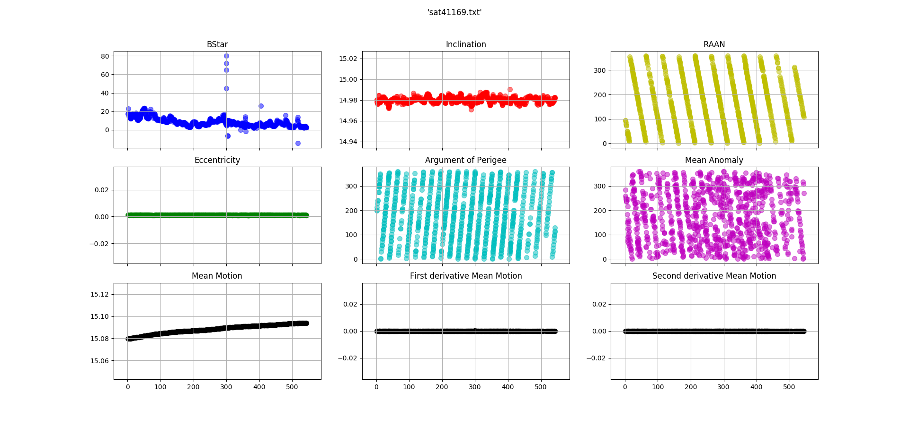
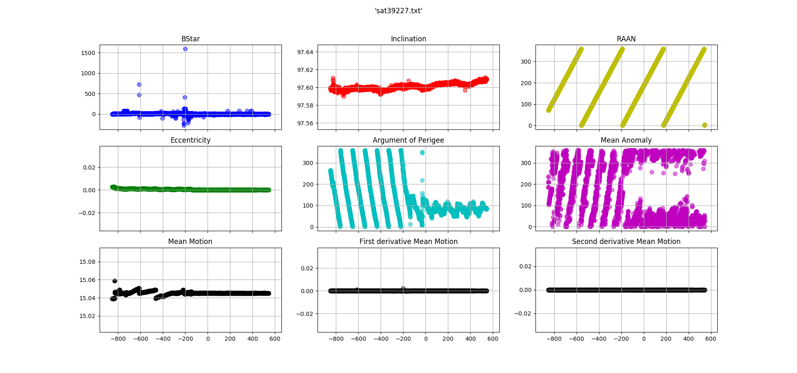

# Two Line Element Predictor
### Author: Tan Ren Jie
### Dated: 14 Oct 2017
[Two Line Elements (TLE)](https://en.wikipedia.org/wiki/Two-line_element_set)[1] is a data format widely used to track objects orbiting Earth. Encoded in the TLE is the 6-D state vectors, [BSTAR](https://en.wikipedia.org/wiki/BSTAR)[2] drag term, first and second derivative of the mean motion, and other miscellaneous of the object.  

There are various established propagation models such as SGP, SGP4, SDP4, SGP8 and SDP8 which are used to predict the future state vectors of the satellites. However, due to the inherent uncertainties of the TLE, this error gets propagated through time as well. For example, a typical TLE downloaded from [Celestrak](https://celestrak.com/)[3], the momentum vector components, Px, Py, Pz, could, on average, carry an uncertainty of +-10km/h. After a day, the uncertainty would be then +-240km/h which is not ideal. Very often, the state vectors produced by such propagation models are not accurate and cannot be used after a day of simulation. They have to be refreshed by getting new TLEs.  

Because of this uncertainties, there are a lot of cry wolf cases. Celestrak offers free reporting of conjuction analysis of satellite payloads with its platform called [Satellite Orbital Conjunction Reports Assessing Threatening Encounters in Space](https://celestrak.com/SOCRATES/) (SOCRATES)[5]. From there you can download AGI viewer files to fun STK/CAT simulation of conjuction analysis reports.  

The event that shook the space world is the first reported payload-to-payload collision in the history of spaceflight. On February 10, 2009, the satellite communications company Iridium lost contact with one of its spacecraft, Iridium 33. Earlier that day, Iridium had received a prediction of a close approach of 584 m (1,916 ft) between Iridium 33 and another orbiting spacecraft, the non-operational Russian communications satellite Cosmos 2251. Iridium had received close approach reports before, and the one on February 10 was not particularly alarming or deemed a “top predicted close approach” compared to other predicted close-approach events for that week. Nevertheless, at the time the close approach was predicted to occur above northern Siberia, Iridium abruptly stopped receiving telemetry from its spacecraft [4].  

## About this project
This is just a toy concept to test out a statistical approach to predict TLE instead of the conventional propagation model. As the cadence of TLE updates is high (~ twice daily), this source of data is suitable for times series analysis or machine learning techniques. In this repo, I would present a simple Linear Regression to predict TLE. As the regression model does not factor in physical laws of Newtonian, the above mentioned error propagation through time of the momentum would not apply.

## Time plots of TLE components

Fig.1 Time plots of the TLE components for sat41169

Fig.1 Time plots of the TLE components for sat39227

## Prediction of Linear Regression Model
# References
[1] Two Line Element https://en.wikipedia.org/wiki/Two-line_element_set  
[2] BSTAR Drag Term https://en.wikipedia.org/wiki/BSTAR  
[3] Celestrak https://celestrak.com/  
[4] Iridium and Cosmos 2251 Collision https://www.nap.edu/read/13244/chapter/11#66  
[5] SOCRATES https://celestrak.com/SOCRATES/  
